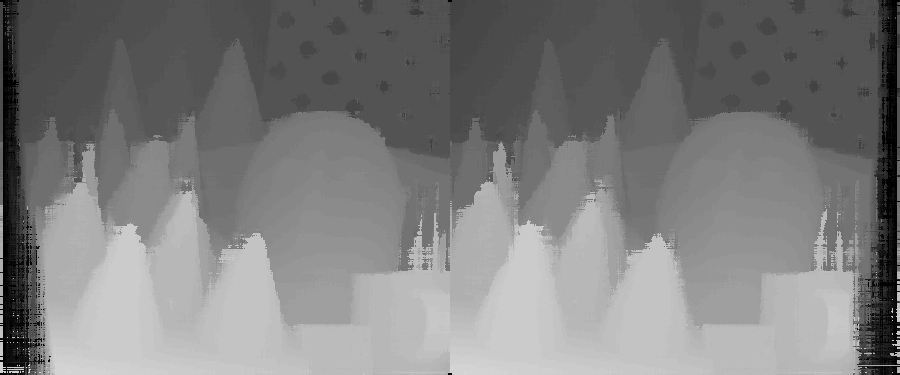

## Semi-Global Block Matching (SGBM) Algorithm

simple implementation of the Semi-Global Block Matching (SGBM) algorithm for stereo matching by NumPy.

### Result

input image:


output disparity map:


### Usage

You need to install [uv](https://docs.astral.sh/uv/)

```bash
uv sync
uv run main.py
```

### Credit

- ww2.mathworks.cn/help/visionhdl/ug/stereoscopic-disparity.html
- https://github.com/beaupreda/semi-global-matching